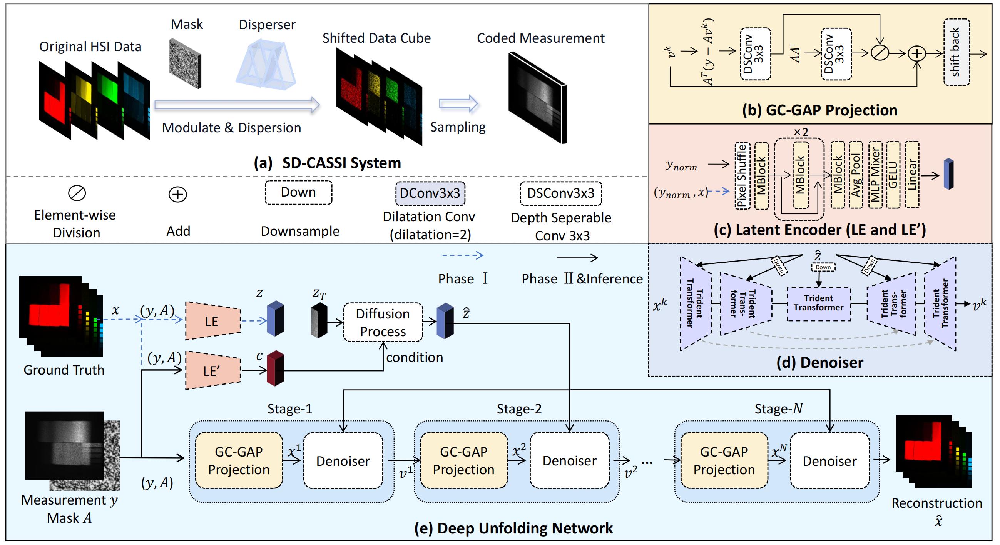
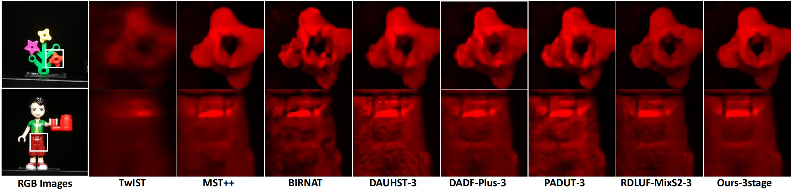

# LADE-DUN for CASSI 
[(ECCV 2024 - Best Paper Award Candidate & Oral)](https://eccv2024.ecva.net/virtual/2024/awards_detail)

This repo is the official implementation of the paper titled "Latent Diffusion Prior Enhanced Deep Unfolding for Snapshot Spectral Compressive Imaging".

# Abstract

Snapshot compressive spectral imaging reconstruction aims to reconstruct three-dimensional spatial-spectral images from a single-shot two-dimensional compressed measurement. Existing state-of-the-art methods are mostly based on deep unfolding structures but have intrinsic performance bottlenecks: i) the ill-posed problem of dealing with heavily degraded measurement, and ii) the regression loss-based reconstruction models being prone to recover images with few details. In this paper, we introduce a generative model, namely the latent diffusion model (LDM), to generate degradation-free prior to enhance the regression-based deep unfolding method by a two-stage training procedure. Furthermore, we propose a Trident Transformer (TT), which extracts correlations among prior knowledge, spatial, and spectral features, to integrate knowledge priors in deep unfolding denoiser, and guide the reconstruction for compensating high-quality spectral signal details. To our knowledge, this is the first approach to integrate physics-driven deep unfolding with generative LDM in the context of CASSI reconstruction. Comparisons on synthetic and real-world datasets illustrate the superiority of our proposed method in both reconstruction quality and computational efficiency.

# Architecture

<div align=center>

</div>

# Results Visualization (Real Data)

<div align=center>

</div>

# Usage 

## Prepare Dataset:
Follow the [RDLUF_MixS2](https://github.com/ShawnDong98/RDLUF_MixS2),
download cave_1024_28 ([Baidu Disk](https://pan.baidu.com/s/1X_uXxgyO-mslnCTn4ioyNQ), code: `fo0q` | [One Drive](https://bupteducn-my.sharepoint.com/:f:/g/personal/mengziyi_bupt_edu_cn/EmNAsycFKNNNgHfV9Kib4osB7OD4OSu-Gu6Qnyy5PweG0A?e=5NrM6S)), CAVE_512_28 ([Baidu Disk](https://pan.baidu.com/s/1ue26weBAbn61a7hyT9CDkg), code: `ixoe` | [One Drive](https://mailstsinghuaeducn-my.sharepoint.com/:f:/g/personal/lin-j21_mails_tsinghua_edu_cn/EjhS1U_F7I1PjjjtjKNtUF8BJdsqZ6BSMag_grUfzsTABA?e=sOpwm4)), KAIST_CVPR2021 ([Baidu Disk](https://pan.baidu.com/s/1LfPqGe0R_tuQjCXC_fALZA), code: `5mmn` | [One Drive](https://mailstsinghuaeducn-my.sharepoint.com/:f:/g/personal/lin-j21_mails_tsinghua_edu_cn/EkA4B4GU8AdDu0ZkKXdewPwBd64adYGsMPB8PNCuYnpGlA?e=VFb3xP)), TSA_simu_data ([Baidu Disk](https://pan.baidu.com/s/1LI9tMaSprtxT8PiAG1oETA), code: `efu8` | [One Drive](https://1drv.ms/u/s!Au_cHqZBKiu2gYFDwE-7z1fzeWCRDA?e=ofvwrD)), TSA_real_data ([Baidu Disk](https://pan.baidu.com/s/1RoOb1CKsUPFu0r01tRi5Bg), code: `eaqe` | [One Drive](https://1drv.ms/u/s!Au_cHqZBKiu2gYFTpCwLdTi_eSw6ww?e=uiEToT)), and then modify the data paths in the `option.py`.


## Pretrained weights and Results

Download pretrained weights and results at ([Onedrive](https://westlakeu-my.sharepoint.com/:f:/g/personal/wuzongliang_westlake_edu_cn/EikQ7Wr9ToNCp6YktuRzDwkBZnyvcB3Hb4meuhmH3YhKXg?e=k7W36q)).

## Environment
```
python==3.10
torch==2.0.1
scikit-image==0.21.0
scikit-learn==1.5.1
numpy==1.24.4
scipy==1.11.2
pyiqa==0.1.7
matplotlib==3.7.2
Pillow==10.0.0
lpips==0.1.4
```
## Simulation Experiement:

See the `readme.md` in the [./train_code_syn](./train_code_syn).

## Real Experiment:

See the `readme.md` in the [./train_code_real](./train_code_real).


## Acknowledgements

Our code is based on the following codes, thanks for their generous open source:

- [https://github.com/ShawnDong98/RDLUF_MixS2](https://github.com/ShawnDong98/RDLUF_MixS2)
- [https://github.com/caiyuanhao1998/MST](https://github.com/caiyuanhao1998/MST)
- [https://github.com/mengziyi64/TSA-Net](https://github.com/mengziyi64/TSA-Net)
- [https://github.com/Zj-BinXia/DiffIR](https://github.com/Zj-BinXia/DiffIR)


## Citation

If this code helps you, please consider citing our works:

```shell
@inproceedings{wu2024latent,
  title={Latent Diffusion Prior Enhanced Deep Unfolding for Snapshot Spectral Compressive Imaging},
  author={Wu, Zongliang and Lu, Ruiying and Fu, Ying and Yuan, Xin},
  booktitle={European Conference on Computer Vision},
  pages={164--181},
  year={2024},
  organization={Springer}
}
```
